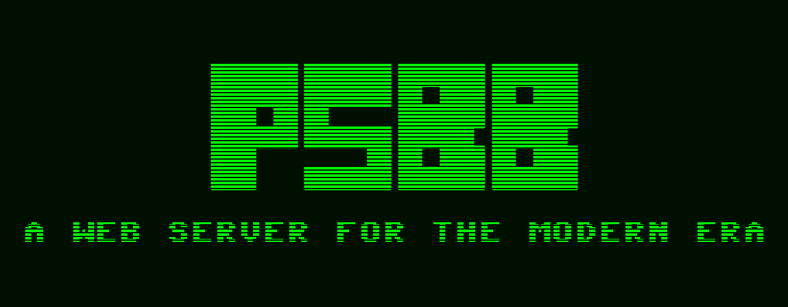

# PSBB



### What Is This?

This is an web application built from the ground up, with the backend
server written in C++, and the front end done in html, css, and
javascript.

### How Do I Run It?

The project is compiled with make, it currently has only been tested on Linux,
but support for Windows will be added in the future. 

Next it is run with 

```./psbb.o```

Some command line options are:

```
--home-dir, -d          set the home directory (default www)
--port, -p              set the running port (default 80)
--index, -i             set the index page (default index.html)
```

An example of using these is:

```./psbb.o --home-dir "www" --port 8080 --index help.html```

### What Are the Future Plans?

Future plans are (in no particular order): 
* More command line options
* Configuration files
* Further http request response support
* Actually making the webpage this server was designed for
* (Tentative) Server side language support 

### Are There Any Security Issues?

Short answer: yes

Long answer: yeeeeeeeeeeeeeees

I have not yet critically analyized the server for large security issues, many of the surface ones have already been accounted for but it has yet to be properly audited.

### What Does the Name Stand For?

Why do you ask so many questions?

###### This project is licensed under the MIT Open Source License.
